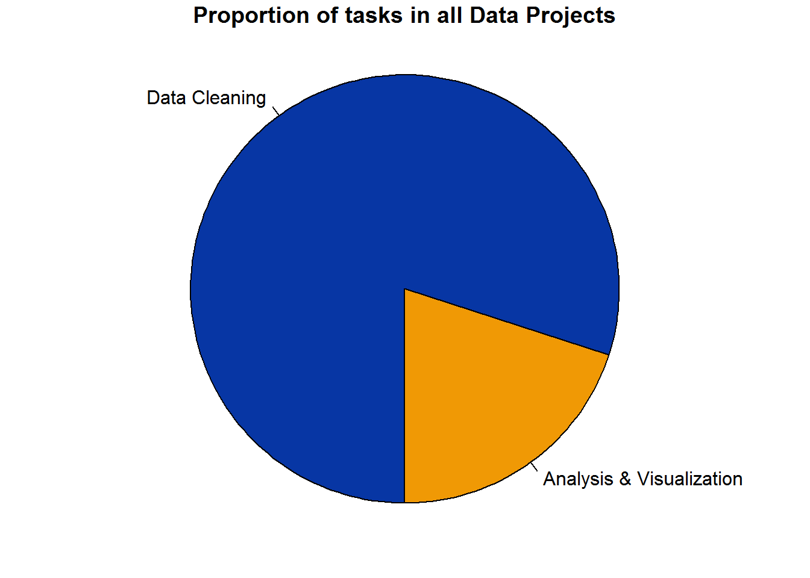
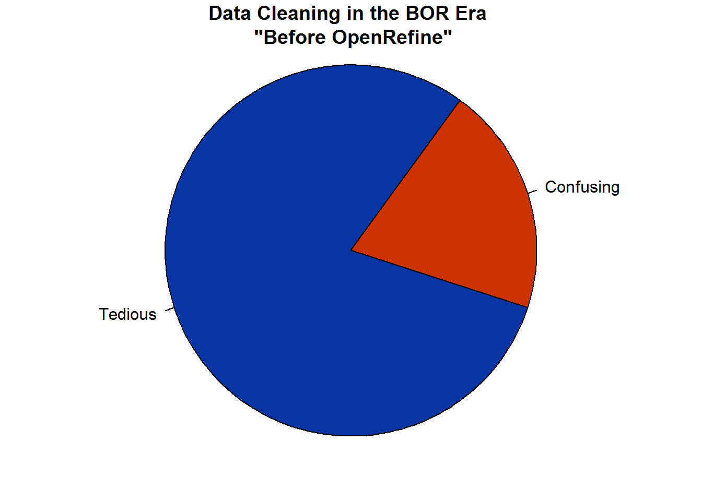
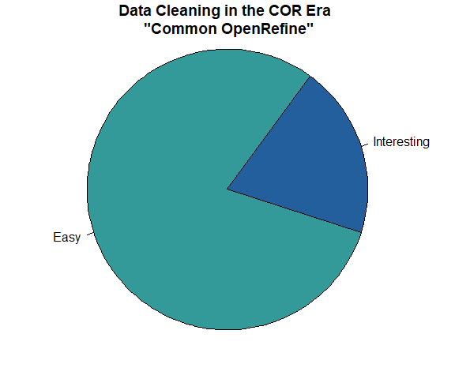

# Preamble {-}

*OpenRefine for Data Cleaning: An Outline for the Workshop*

[John Little](https://johnlittle.info/)  
[Data & Visualization Services](http://library.duke.edu/data) (the /Edge - Bostock Library)  
Duke University Libraries  

**tl;dr...**  OpenRefne = good; data cleaning = good; learn by doing; [Skip to the hands-on](#start) sections in this workbook.

### Testimonial {-}  

I like OpenRefine for data cleaning, exploratory scripting, and data gathering including API orchestration. <i>Refine</i> is both very good and very easy to use.  The comparative advantage lies with the  ease of design and simple menu-navigation allowing the user to perform reproducible and shareable data transformations.  

There are other programming languages/tools (such as R, Python, Excel, or Google Sheets) which can accomplish many of the same tasks.  The unique advantage for <i>Refine may</i> be the clustering technology. It is easy to find and correct spelling variations, or generally clean dirty and unstructured data.  Indeed, for the specific task of data cleaning, OpenRefine is unquestionably easy to learn and easy to use.  The power of the menu operations afford sophistication without having to memorize programming language syntax or commands.  If you're not a programmer this can be a huge value.  Essentially you can remain a subject expert in your field but perform powerful transformations without feeling like you are on dual-track treadmill -- trying to become a programmer and a subject expert. 

OpenRefine relieves me of the need to memorize file handle syntax, file management, or even looping and logic structure syntax.  But all of those techniques are availble to me if and when I really want them.  For programmers there is a benefit of not clouding up your wetware with a whole passel of commands which might only confound you as they muddle your expertise with another programming language.  (Oh, I know this never happens to *you*, but it does to others -- I've heard told).  Combine ease-of-use qualities with reproducibility and it's almost mind boggling that <i>Refine</i> is not more famous.  The simple secret is <i>Refine</i> is easy to learn <i>and</i> offers an extensible  feature set.  In short, OpenRefine produces dividends for the effort you put into it.  And it really grows on you.  

I hope you enjoy learning about OpenRefine.

## Workshop Philosophy {-}

I developed this workbook to consist of hands-on exercises that will reinforce my in-person instruction.  My instruction is aimed at promoting a learn-by-doing, and learn-by-observation approach.  So, essentially, if you're in the workshop, you can **listen to my brief introdution and then skip to the hands-on sections**. Or you can watch the recording (below.)  The remainder of this section consists of some overview about OpenRefine that may be important.  At the same time, it's lecture, so we may learn it another way in the workshop.  

I like to think of this workshop and workbook as a cooking metaphor. I'll introducing you to a bunch of spices (functions).  Then I'll give you some recipes.  I won't give you a lot of theory.  If you complete each recipe and follow each step, the recipe will turn out.  If you pay attention, you learn something about how to combine the elements.  Your exposure to the spices will help you learn what works and what you like.  Best of all, as you gain experience with the possibilities you can learn more as you experiment on your own.  

  

## On Data Cleaning {-}

It has been [written](https://www.nytimes.com/2014/08/18/technology/for-big-data-scientists-hurdle-to-insights-is-janitor-work.html) that 80% of any data project is comprised of *data cleaning*.  

```{r, eval=FALSE, message=FALSE, warning=FALSE, include=FALSE}
par(mar = c(0, 1, 0, 1))
pie(
  c(288, 72),
  c('Data Cleaning', 'Analysis & Visualization'),
  col = c('#0736A4', '#F09905'),
  init.angle = -18, border = T, main="\nProportion of tasks in all Data Projects"
)
```




Furthermore, of that data cleaning part, 80% of that is *tedious* while the remaining 20% is *confusing*.  

```{r, eval=FALSE, message=FALSE, warning=FALSE, include=FALSE}
par(mar = c(0, 1, 0, 1))
pie(
  c(288, 72),
  c('Tedious', 'Confusing'),
  col = c('#0736A4', '#CC3300'),
  init.angle = 54, border = T, main='\n\nData Cleaning in the BOR Era \n "Before OpenRefine"'
)
```



I prefer to think of data cleaning as a puzzle rather than a tedium.  Data cleaning is a necessary step. If given short shrift, your data will become problematic and the clearning process will still have to be addressed.   Finally, since this is not an analysis book,  let me remind you of the old adage: "garbage in, garbage out".  Clean your data and decrease the chances of producing garbage.  Keeping in mind that the bulk of any data project involves data cleaning, you may as well have the best tools at your fingertips; you may as well do a good job; and, you may as well enjoy the puzzle. OpenRefine to the rescue... 

```{r, eval=FALSE, message=FALSE, warning=FALSE, include=FALSE}
par(mar = c(0, 1, 0, 1))
pie(
  c(288, 72),
  c('Easy', 'Interesting'),
  col = c('#339999', '#235F9C'),
  init.angle = 54, border = T, main='\n\nData Cleaning in the C.O.R. Era \n "Common Open Refine Era"')
```



One reason data cleaning is such a challenge is that information is naturally unstructured.  Meanwhile, most analysis tools prefer precise data structures.  Transforming your unstructure mass  into a proper structure is often as idiosyncratic as the data you are trying to analyze.  Therefore, I invite you to learn about data cleaning in this workbook.  

## Workshop Video {-}

This recording is from a previous workshop.  Although some of the content has changed, you can follow the video covering the first two hands-on sections.  On the [DVS workshop recordings](http://library.duke.edu/data/news/past-workshops) page.

<div class="video"> 
<iframe height="360" width="640" src="https://warpwire.duke.edu/w/-4YBAA/" frameborder="0" scrolling="0" allowfullscreen></iframe>
</div> 


## For Best Results {-}
1. The hands-on approach includes a reliance on the [data-science](http://drewconway.com/zia/2013/3/26/the-data-science-venn-diagram) notion of "[hacking](https://datajobs.com/what-is-data-science)" (not "cracking").  Pay attention to what you are seeing, what you are typing, what happens, what transforms, the end-result vis-a-vis the initial state of the data.  
2. Learn by doing  
3. Learn *best* by working on your own project  


## Comparative Advantage {-}

Why Use OpenRefine vs. Excel or other tools?

* Easy   
    + Menu driven **faceting**, and **filtering**
    + Clean up data inconsistencies using powerful **clustering** and edit algorithms 
    + Transforming Data 
* Advanced power comes from Regular Expressions implementation via GREL  
* Web scraping:  API orchestration, HTML/JSON parsing
* Why Use OpenRefine? 
    + you don't want to be a data engineer, but you need to fix your data
        + Don't have to deal with file handling  
        + Don't have to deal with iterating (looping logic)  
        + Don't have to write complex conditional statements  
        + Don't have to think hard to manipulate arrays  
    + Or, you are a lazy programmer (i.e. a smart programmer) 
    + Or, you are a subject matter expert and Refine is the right tool for the job
* Frequently, OpenRefine is simpler to use than Excel for data transformations
    + Regular Expressions vs. Excel Formulas ^[The regex v excel-formul table is not a "fair fight" but it does illustrate what all regular expression users understand:   regex is a better tool than excel formulas for data cleaning.]


|  Expression Language | Expression |
|---|------------------------------------------------------------------------|
GREL | `value.match(/`<span class="highlight-yellow-fixed">(\^&#91;0-9&#93;\{1,2\}\\w\\w)</span>`\s(.*)/)[0]` 
Excel Formula | `INDEX(salary!$C$1:$C$4,MATCH(1,('player DB'!$A2=salary!$A$1:$A$4)*('player DB'!$B2=salary!$B$1:$B$4),0))`

## Characteristics {-}

### General {-}

[OpenRefine](http://openrefine.org) is an **open source data cleaning** and **transformation** application used for [Data Wrangling](https://en.wikipedia.org/wiki/Data_wrangling).

* Refine looks like a spreadsheet but it's really a database  
    + There is an OpenRefine statistical extension for simple statistics  
    + Extensions are listed on the download page  
* Transformations are performed on all MATCHING rows  
* Easily find the “shape” of the data  
* User Interface is your local web browser (Chrome or Firefox)  
    + Application is a Java Virtual Machine (JVM) on your local CPU -- not a cloud service  
* File ingest Formats include:  TSV, CSV, Excel, XML, RDF, JSON, Google Fusion Tables and Google Spreadsheets  
    - Paste in raw data  
    - Scrape from the Web  
    - Orchestrate API calls  
* File export Formats include: TSV, CSV, Excel, HTML table, Templating (e.g. JSON), and whole OpenRefine Projects  
    * Auto-save your projects  
    * Auto-save all processing steps  
    * Enables export and share  
* 50,000 Rows (1.4 GB RAM ) ; Upper limit is about 5 Million Rows (requires some memory allocation)  


### Video {-}
Watch this excellent and brief Video Introduction.  It only takes a **few minutes**.  And then watch part 2 and part 3 to expand your knowledge.  

<div class="video">
<iframe width="560" height="315" src="https://www.youtube.com/embed/B70J_H_zAWM?list=UUqwSVsJ8CWD9pQUZDbJC1ew" frameborder="0" allowfullscreen></iframe>
</div>

## Reproducible {-}

Refine supports reproducible research.  

- **Undo**:  every step is recorded and can be undone.
- **Share**:  your steps are recorded and can be shared in a JSON notation
- **Rerun**:  did I say your steps are recorded?  Not only that, but those "recordings" can be shared with others or re-run on future data.
- **Projects**:  each OpenRefine "project" retains a history of all your steps.  The project can be exported and subsquently imported to other instances of OpenRefine.
- **Exporting**:  There is a powerful export mechanism that allows you to build selective reports

## Documentation {-}

- User documentation is the ["Official Documentation Wiki"](https://github.com/OpenRefine/OpenRefine/wiki)

- [The *Using OpenRefine* Book, the email list, and other stuff](http://openrefine.org/documentation.html)


