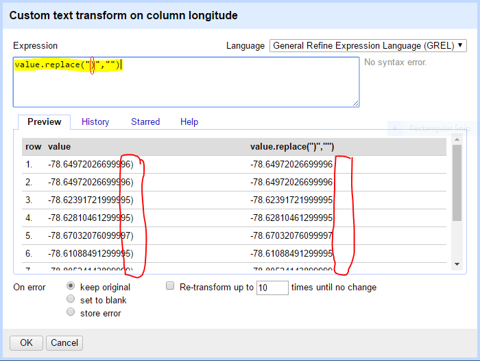

# Hands-on: basic transformations {#start}

## Getting Started
We'll use a **subset**[^1] of [Raleigh Building Permits data](https://github.com/libjohn/openrefine/tree/master/data) 

1. Launch the Open-Refine icon from your computer (find and double-click the jewel icon.)
    + [Installations / Start / Stop instructions](https://github.com/OpenRefine/OpenRefine/wiki/Installation-Instructions) 
    + [Owen Stephens's helpful video illustrating installation](https://summit.uwaterloo.ca/p389l6kkluv/?launcher=false&fcsContent=true&pbMode=normal)
    + Remember: The User Interface for Refine is Chrome or Firefox 
        + If your default browser is one of these, Refine will auto-launch to http://127.0.0.1:3333
        + If your default browser is IE, you’ll need to open the following URL http://127.0.0.1:3333 in Chrome or Firefox
2. Create Project  > Web Addresses (URLs) > `https://github.com/libjohn/openrefine/raw/master/data/subset%20Raleigh%20Building%20Permits.csv`  
3. Click Next >> 
4. Select:  Columns are separated by “commas (CSV)”
5. Change the Project Name to `Raleigh Building Permits` and click Create Project >> (top-right) 

<iframe width="560" height="315" src="https://www.youtube.com/embed/lPN6fHjmzZA?list=PLIUcX1JrVUNXSgBbyMCluwaJYTWJ--fDd" frameborder="0" allowfullscreen></iframe>

## Shutting Down OpenRefine

It's IMPORTANT to properly shutdown the application.  OpenRefine will automatically save your project as you transform your data. **However**, in my experience your **last opertion** *may* have to be **manually saved** by following the procedures below...

**Windows**:  `Control-C`
**Mac**:  Click the OR app in the doc, invoke Quit

NOTE:  It is possible, but not guaranteed, to lose data if you don't follow the rather unintuitive shutdown procedures.  Better safe than sorry.

## Facets & Cluster

### Facet & Cluster {#handson-facets -}
Goal 1:  Create a facet of authorized work.  Cluster & Merge types of authorized work.

1. *How many rows are in this dataset?* ([answers are found in the appendix](#appendix-facets))
2. Slide the bottom column navigation bar to the right
    + find the authorized_work column 
    + click the column header:  authorized_work > Facet > Text facet
3. *How many facets are there?*  ([answer](#appendix-facets))  
4. In the Facet box, click `count`.  
    + *What is the 4th most popular type of authorized work?* ([answer](#appendix-facets))
    + *How many permits are recorded?*  
5. To find spelling clusters, click the `Cluster` button in the facet box
6. Using the `Select All` button `Merge Selected & Re-Cluster` all terms 
by the defaults (Method = “key collision” ; Keying Function = “fingerprint”)
7. Do the same for the “ngram-fingerprint” Keying Function, then close the 
Cluster & Edit dialog box
8. *How many SCREEN PORCH facets now exist?* ([answer](#appendix-facets))

<iframe width="560" height="315" src="https://www.youtube.com/embed/QjXkUoFykkk?list=PLIUcX1JrVUNXSgBbyMCluwaJYTWJ--fDd" frameborder="0" allowfullscreen></iframe>

### Compound Facets {#compound-facets -}  

1. Select the DECK Facet.  
    + *How many matching rows match the Deck Facet?*  ([answer](#appendix-compound))
2. Select the SCREEN PORCH facet combined with the DECK Facet. (Hover your mouse over the facet, click `include`) 
    + *Now how many matching rows exist?*  ([answer](#appendix-compound))
3. On the “land_use_code” column, make a text facet and limit to “SINGLE FAMILY”  
4. On the “county” column, make a text facet and limit to Durham County (DURH)  
    + *How many “Single Family” homes got permits in Durham County for Screen Porches or Decks?*  ([answer](#appendix-compound))
    + *Is the authorized work for Screen Porches, Decks, or both?*  ([answer](#appendix-compound))
5. Click the “Remove All” button to remove all text facets.  
    + *How many matching rows are in the dataset now?*  ([answer](#appendix-compound))

<iframe width="560" height="315" src="https://www.youtube.com/embed/orkVO4ORV-4?list=PLIUcX1JrVUNXSgBbyMCluwaJYTWJ--fDd" frameborder="0" allowfullscreen></iframe>

### Mass Editing {-}
It's important to understand OpenRefine was designed to transform data in bulk.  It is possible to edit single data cells but it is not as convenient as some other, more WYSWIG, tools.  This exercise will help you learn how to accomplish these kinds of mass data transformations

1. Make a facet on the work_type_description column
2. There are two facets for new buildings:  “NEW BUILDING” and “New Building”
*How many “NEW BUILDING” rows exist; how many “New Building” rows exist?* ([answer](#appendix-mass-edit))
3. Select “NEW BUILDING” facet, limiting to 3 matching rows.  Hover your mouse over the all caps “NEW BUILDING” facet until you see the “edit” feature appear; click “edit” and alter the text to title case:  “New Building” ; click Apply
*How many “New Building” rows exist now?* ([answer](#appendix-mass-edit))
4. Mass edit “OTHER” & “Other” so they have the same value
5. Mass edit “ALTERNATIONS/REPAIRS” and “Alternations/repairs” so they have 
the same value
6. Click “Remove All” to remove the facet

<iframe width="560" height="315" src="https://www.youtube.com/embed/2lrGWTXjgtw?list=PLIUcX1JrVUNXSgBbyMCluwaJYTWJ--fDd" frameborder="0" allowfullscreen></iframe>

## Split data in cells
1. address > Edit column > Split into several columns…  
    + Separator = `(` > OK
2. address 2 > Edit column > Split into several columns…  
    + Separator = `,` (i.e. accept default and click) >  OK
3. address 2 1 > Edit column > rename this column  
    + `latitude`
4. address 2 2 > Edit column > rename this column  
    + `longitude`  
    
(more data transformation could be done, but let’s move on for now…)

<iframe width="560" height="315" src="https://www.youtube.com/embed/gURKGsumqRw?list=PLIUcX1JrVUNXSgBbyMCluwaJYTWJ--fDd" frameborder="0" allowfullscreen></iframe>

## Concatenate cells together
1. square_feet > Edit column > Add column based on this column…  
    1. New column name = `Full Description`
    2. Expression = `value + cells["proposed_work"].value`

The last step adds two columns together, but the preview screen is hard to read. Make it readable by using the next expression instead ...  

2. Expression = `value + " sq ft. " + cells["proposed_work"].value` > OK

## More Transformations

Looking at the latitude and longitude cells, one column appears in green text (indicating OpenRefine considers data those cells as numbers) and one column appears in black with a closing parenthesis in the last position.  Convert both columns to text, trim leading and trailing spaces, and then find and replace the parenthesis

### Data Types {-}    
1. latitude > Edit cells > common transformations > To text  

### Whitespace {-}   
2. longitude > Edit cells > common transformations > Trim leading and trailing whitespace   

### Search & Replace {-}  
3. longitude > Edit cells > Transform… 
    + Expression = `value.replace(")","")`
    
    

## Web Scraping

### Select a subset {-}

We want to gather the FIPS code for a subset of the data.  The government server returns data in a JSON format so we’ll parse the data after we retrieve it. First we’ll subset our dataset for expediency.  This limits our waiting time during the workshop.

1. issue_date > Facet > Custom text facet… 
    + expression = `value.slice(6,10)`
2. select the “2014” facet
3.  authorized_work > Facet > Text facet 
4. select the “3 SEASON ROOM” facet

You should now have 6 matching rows.  Next we’ll use Refine to gather data from another website.  Our Goal is to get the FIPS code for all counties. 

### API {-}

Now let’s fetch the data from an [API](http://www.broadbandmap.gov/developer/) made available via the [National Broadband Map](http://www.broadbandmap.gov/). This API returns a FIPS code if we give it a county name (or in this case, even a partial county name.)

5. fetch JSON data from the National Broadband Map.  We’ll use the [API documentation for Geography by Name API](http://www.broadbandmap.gov/developer/api/census-api-by-geography-name) which returns Census geography for a geography name (e.g. Durham)  
    + The documentation informs us that the format of the URL we want to construct is as follows:
http://www.broadbandmap.gov/broadbandmap/census/county/durh?format=json 
    + Notice the data values in the “county” column.  All we do is construct a URL which calls the value of the cells from each row of the “country” column
    +  county > Edit column > Add column by fetching URLs… 
    + New column name = `JSON data`
    + Throttle delay = `2000`
    + Expression =  
`'http://www.broadbandmap.gov/broadbandmap/census/county/'+value+'?format=json'`
    + OK

### Parse {-}

Now parse the value of the JSON data “fips” element; call the “fips” key when traversing the “county” objects from the Results set.

6.  JSON data > Edit column > Add column based on this column ...  
    * New column name = `FIPS Code`  
    * expression = `value.parseJson().Results.county[0].fips`  
    * Note the square-bracket (`[0]`) notiation in the `ParseJson()` function denotes and identifies the first array element.  It's the first element because in OpenRefine counting begins with zero (e.g. 0,1,2,3,4,5).  The county array in the example below consists of only 1 value element (consisting of four, named key/value pairs; of which fips is one key).  Since the JSON notation indicates county is an array, in this case of quantity 1, we identify that first element of the array by the number '0'.  See the JSON example below   
    
<iframe width="560" height="315" src="https://www.youtube.com/embed/DbjpmVEpMiI?list=PLIUcX1JrVUNXSgBbyMCluwaJYTWJ--fDd" frameborder="0" allowfullscreen></iframe>
    
### JSON Data Example {-}

JSON ^[[Wikipedia entry for JSON](https://en.wikipedia.org/wiki/JSON)] is JavaScript Object Notation a data wrapper.  The API, in this case, returns the data in a JSON format.

<pre>
{
  "status": "OK",  
  "responseTime": 14,  
  "message": [  ],  
  "Results": {  
    "county": [  
      {  
        "geographyType": "COUNTY2010",  
        "stateFips": "37",  
        "fips": "37063",  
        "name": "Durham"  
      }  
    ]  
  }  
}  
</pre>

  [^1]: Original Data Source:  [Master Building Permit Data Set](https://data.raleighnc.gov/Urban-Planning/City-of-Raleigh-Building-Permits-from-Jan-2000/hk3n-ieai?category=Permits)